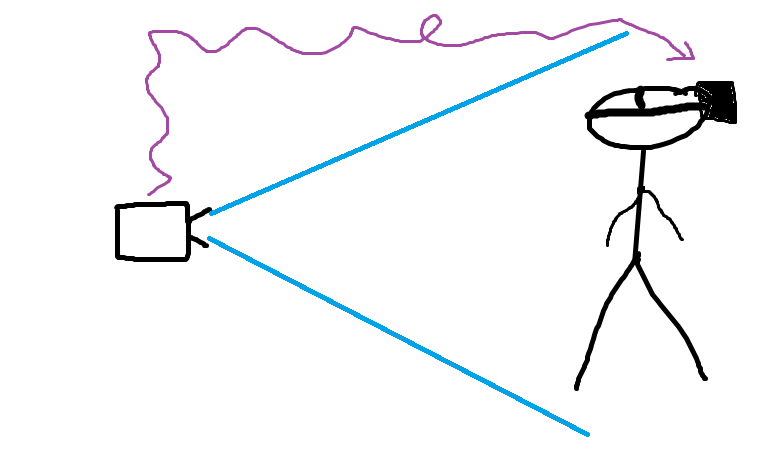

# V-TARD
The Virtual Third-person Augmented Regurgitation Device
## What it does
This program starts a flask webserver that displays a distorted video of a connected camera

The distortion works in such a way that it can be used with Google Cardboard/Samsung Gear and similar devices

The idea is that you start the server and post camera input to the website,
then connect yourself with your phone to show what the camera sees. Connect this to a laptop/raspberry pi/jetson and boom.
You, too can experience the sickening exposure to 3rd-person reality.

Here is a simple illustration of the concept:

## Why would anyone want this
Most people don't, you can play around with time delays and such and someone will probably throw up.

## How to do it
1. Connect your phone and server to the same network (5GHz, otherwise there's substantial lag)
2. ``pip install -r requirements.txt`` (depending on your setup, you might want to choose ``opencv-python-headless``)
3. Change the port of the server in app.py (optional)
4. ``python3 app.py`` will start the webserver (make sure your camera is connected)
5. Go to the ip and port of your server on your phone and insert it into the faux-VR headset of your choice
